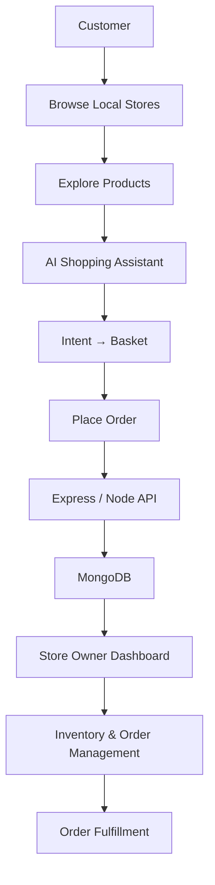

<div align="center">

# 🛒 KiranaWala

### **Your local kirana store, online.**

**AI-assisted local commerce connecting customers with neighbourhood stores.**

<p>
  
  
  
  
  
  
</p>

**Discover stores · Browse products · Shop locally · Order online · Shop smarter with AI**

</div>

---

## 💡 What is KiranaWala?

KiranaWala brings the neighbourhood grocery experience online without losing its local-store focus.

| 🛍️ Customer | 🏪 Store Owner |
|---|---|
| Discover nearby stores | Manage store profile |
| Browse store products | Manage products & inventory |
| Build a basket | Manage orders |
| Place grocery orders | Operate from a dashboard |
| Use AI-assisted shopping | Serve local customers |

### 🤖 AI-assisted shopping

Natural-language shopping intent is being connected to **basket generation**, moving the experience beyond conventional product browsing.

---

## ✨ Core Capabilities

- 🏘️ **Local-first commerce** — customers and neighbourhood stores
- 🛍️ **Customer experience** — discovery, products and ordering
- 🏪 **Store management** — products, inventory and orders
- 🤖 **AI shopping** — intent → basket workflow
- 🔐 **JWT authentication** — customer and store-owner access
- 🗄️ **MongoDB persistence** — users, stores and products
- ⚙️ **REST API** — Express/Node backend
- 🐳 **Docker + CI** — reproducible development and automated checks

---

## 🔄 End-to-End Workflow



---

## 🏗️ Architecture

```text
Customer
   │
   ▼
Frontend (HTML · CSS · JS)
   │
   ▼
Express / Node REST API
   │
   ├──────────────► JWT Authentication
   │
   ├──────────────► MongoDB
   │                 └─ Users · Stores · Products · Orders
   │
   └──────────────► AI Experience
                     └─ Intent → Basket

Store Owner ───────► Dashboard ───────► Inventory & Orders
```

---

## 🛠️ Tech Stack

| Layer | Technology |
|---|---|
| Frontend | HTML, CSS, JavaScript |
| Backend | Node.js, Express.js |
| Database | MongoDB |
| Authentication | JWT |
| Testing | Project test suite |
| Quality | ESLint |
| CI/CD | GitHub Actions |
| Containers | Docker / Docker Compose |

---

## 📂 Project Structure

```text
KiranaWala/
├── .github/workflows/       # CI & lint workflows
├── public/
│   ├── css/                 # Styles
│   ├── images/              # Assets
│   └── js/                  # Client-side logic
├── server/
│   ├── models/              # MongoDB models
│   ├── routes/              # API routes
│   ├── __tests__/           # Backend tests
│   └── server.js            # API server
├── views/
│   ├── customer/            # Customer UI
│   └── store-owner/         # Store dashboard & auth
├── docker-compose.yml
├── package.json
└── README.md
```

---

## 🔌 API Surface

| Area | Endpoint | Purpose |
|---|---|---|
| Customer | `POST /api/customer/register` | Register customer |
| Customer | `POST /api/customer/login` | Authenticate customer |
| Store Owner | `POST /api/store/register` | Register store owner |
| Store Owner | `POST /api/store/login` | Authenticate store owner |

> API capabilities are evolving alongside inventory, ordering and AI features.

---

## 🚀 Quick Start

### Prerequisites

**Node.js 14+ · MongoDB · npm · Docker (optional)**

```bash
git clone https://github.com/Jyatin/KiranaWala.git
cd KiranaWala
npm install
```

Create `.env`:

```env
MONGO_URI=your_mongodb_uri
JWT_SECRET=your_secret_key
PORT=3000
```

Run:

Production mode:

```bash
node server/server.js
```

Development mode (with auto-reload):

```bash
# From project root:
npm run dev

# Or directly from the server directory:
cd server
npm run dev
```

Open:

```text
http://localhost:3000
```

---

## 🐳 Run with Docker

KiranaWala includes Docker configuration for containerized development.
Or with Docker:

```bash
docker compose up --build
```

> Never commit real credentials or `.env` files.

---

## 🧪 Engineering

The repository includes backend tests, ESLint configuration, GitHub Actions workflows and Docker configuration.

```text
server/__tests__/
.github/workflows/
Dockerfile / docker-compose.yml
```

---

## 🗺️ Roadmap

- [x] Customer & store-owner authentication
- [x] Store/product foundations
- [x] AI shopping assistant foundation
- [x] Intent-based basket integration
- [ ] Complete order lifecycle
- [ ] Advanced inventory & analytics
- [ ] Context-aware AI recommendations
- [ ] Expanded automated test coverage

---

## 🤝 Contributing

Contributions are welcome.

```bash
git checkout -b feature/your-feature
git add .
git commit -m "feat: describe your change"
git push origin feature/your-feature
```

Then open a Pull Request with what changed, why, and how it was tested.

---

## 👨‍💻 Author

<div align="center">

### Jyatin Singh

<a href="https://github.com/Jyatin">GitHub</a> ·
<a href="https://www.linkedin.com/in/jyatin-singh-88984831b/">LinkedIn</a> ·
<a href="mailto:singhjyatin@gmail.com">Email</a>

**Built with ❤️ for better local commerce.**

</div>
