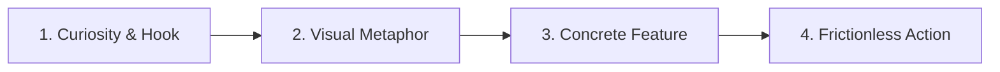

# 🏛️ Comprehensive Klarna Design, UX, Motion & Product Storytelling Study

> **Document Purpose**: An intensive, senior-level design, UX, motion, visual, and interaction analysis of [https://www.klarna.com/us/](https://www.klarna.com/us/) and official Klarna brand systems ([brand.klarna.com](https://brand.klarna.com)). This document serves as the permanent research foundation for building an **original, world-class KiranaWala frontend experience** inspired by the same tier of craft, editorial restraint, and product storytelling.

---

## 1. EXECUTIVE SUMMARY & RESEARCH METHODOLOGY

- **Subject Analyzed**: Klarna US Digital Flagship ([klarna.com/us](https://www.klarna.com/us/)) & Klarna Brand System Core ([brand.klarna.com](https://brand.klarna.com)).
- **Perspective**: Senior Creative Director, Brand & Product Designer, Motion Designer, UX Architect, and Conversion Specialist.
- **Core Finding**: Klarna’s visual dominance is not accidental or purely cosmetic; it is a systematic convergence of **high-fashion editorial discipline**, **surrealist playful art direction**, and **frictionless fintech utility**. It deliberately avoids every known SaaS cliché (generic blue gradients, centered card grids, floating illustration vectors) in favor of high-contrast typography, confident whitespace, and tactile cinematic media.

---

## 2. BRAND & VISUAL IDENTITY

### 2.1 Brand Ethos & Personality: "Curiously Bold"
Klarna organizes its entire verbal and visual identity around three pillars:
1. **Offbeat Optimists**: Playful, unexpected, injecting joy and surreal charm into dry financial transactions.
2. **Strikingly Relevant**: Hyper-contextualized to modern lifestyle culture, fashion, dining, travel, and daily essentials.
3. **Straight Up**: Radical clarity, no hidden fine print in the UI, transparent, direct, and authoritative.

### 2.2 Emotional Tone & Why It Feels Premium
- **Editorial Poise**: Pages are structured like luxury print magazines (Vogue, Monocle, Kinfolk) rather than software dashboards.
- **Surreal Tactility**: Everyday objects (e.g., groceries, credit cards, luggage, coffee) are photographed with high-gloss studio lighting and unexpected juxtaposition.
- **Confidence Through Restraint**: Klarna does not crowd the screen with 15 competing calls to action. A single screen often contains just one massive headline, one razor-sharp product visual, and one magnetic CTA button.
- **Visual Tension**: Asymmetric layout grids, oversized display typography bleeding off comfortable margins, and dramatic shifts in background tones between sections.

---

## 3. COLOR SYSTEM & PALETTE DISCIPLINE

### 3.1 Observed Color Tokens & HEX Specifications

| Token Name | HEX Code | Role / Usage |
|---|---|---|
| **Klarna Pink** (Signature Brand) | `#FFA8CD` / `#FFB3C7` | Iconic accent, hero focal points, promotional badges, key highlights |
| **Klarna Black / Deep Ink** | `#0B051D` / `#0F172A` | Primary display headlines, high-contrast primary CTA buttons, dark editorial sections |
| **Off-White / Warm Canvas** | `#FAF8F5` / `#F9F8F5` | Universal page background; softens stark digital glare and provides an editorial print feel |
| **Pure White** | `#FFFFFF` | Elevated card surfaces, floating modals, input fields |
| **Subtle Slate / Gray** | `#E8E2D9` / `#CBD5E1` | Hairline borders (1px), subtle divider lines, inactive states |
| **Text Secondary** | `#475569` / `#64748B` | Subheadings, feature explanations, metadata |
| **Status Emerald** | `#059669` / `#10B981` | Positive financial states, cashback confirmations, in-stock badges |

### 3.2 Color Ratios & Distribution Rule (60-30-10)
- **60% Neutral Base (`#FAF8F5` & `#FFFFFF`)**: Massive surface area of breathing room.
- **30% High-Contrast Structure (`#0B051D`)**: Sharp typography, authoritative structural dividers, and solid dark button states.
- **10% Punchy Accent (`#FFA8CD`)**: Surgical application. Klarna never turns the entire page pink; it uses pink as an unmistakable punctuation mark (pills, badges, hero accents).

---

## 4. TYPOGRAPHY ARCHITECTURE & CRAFT

### 4.1 Custom Typeface Pairing
- **Headline Font**: *Klarna Title* (Custom bespoke geometric display typeface by Colophon Foundry).
  - Characteristics: High x-height, tight geometric curves, ultra-bold weights, tight negative letter-spacing (`-0.03em` to `-0.04em`), humanistic warmth.
- **Body Font**: *Klarna Text* (Custom workhorse sans-serif).
  - Characteristics: Exceptional legibility at small sizes (13px–16px), open apertures, neutral yet sophisticated geometry.

### 4.2 Typographic Hierarchy & Scale

```text
Display Hero (Desktop)  → 64px–84px | Line-height: 1.05 | Letter-spacing: -0.035em | Bold/Heavy
Section H1 / H2         → 40px–52px | Line-height: 1.12 | Letter-spacing: -0.025em | Bold
Feature Title H3        → 24px–32px | Line-height: 1.25 | Letter-spacing: -0.015em | SemiBold
Body Lead               → 18px–20px | Line-height: 1.50 | Letter-spacing: 0em      | Regular/Medium
Body Standard           → 15px–16px | Line-height: 1.55 | Letter-spacing: 0em      | Regular
Metadata & Captions     → 12px–13px | Line-height: 1.40 | Letter-spacing: +0.02em  | Medium
Micro Badges / Tags     → 11px–12px | Line-height: 1.00 | Letter-spacing: +0.05em  | Bold / Uppercase
```

### 4.3 Distinctive Typographic Behaviors
- **Sentence Case Mastery**: Display headlines are consistently set in sentence case rather than title case, making the tone conversational, editorial, and confident rather than corporate.
- **Signature Offset Alignment**: Headlines frequently feature intentional typographic offsets or staggered line lengths that create dynamic visual rhythm across wide screens.

---

## 5. GRID, LAYOUT & COMPOSITION SYSTEM

### 5.1 Fluid Editorial Grid Specifications
- **Max Content Container Width**: 1440px (with full-bleed background breakout capabilities).
- **Responsive Margins**:
  - Desktop: `6%` standard outer page margins (expanding to `10%–12%` for exclusive editorial moments).
  - Tablet: `4%` margins.
  - Mobile (<= 640px): `16px–20px` margins.
- **Columns**: 12-column adaptive layout with flexible half-gutters (16px–24px) for tighter, magazine-like image/copy pairings.
- **Vertical Rhythm**: Generous section spacing (`clamp(64px, 10vw, 128px)`), allowing users to process one concept completely before scrolling to the next.

### 5.2 Asymmetry & Content Density
- Instead of symmetric 3-column feature grids, Klarna favors **Bento / Asymmetric split layouts** (e.g., 7-column media block paired with 5-column editorial text block, alternating rhythmically).
- **Whitespace Confidence**: Large negative spaces surround key value propositions, turning each section into a standalone poster.

---

## 6. NAVIGATION ARCHITECTURE & INTERACTION MODEL

### 6.1 Header Specifications
- **Height**: 72px–80px desktop; 60px mobile.
- **Logo Anchor**: Crisp custom wordmark pinned firmly to the left.
- **Primary Menu**: Center-aligned or left-adjacent navigation links (`Shop`, `Pay Later`, `Klarna Card`, `Business`, `Help`) with clean 15px typography and generous 24px click padding.
- **Action CTAs**: Right-pinned secondary action (`Sign in`) paired with a high-contrast pill CTA (`Get the app` or `Get started`).

### 6.2 Scroll & State Behaviors
- **Initial State**: Transparent or seamless background matching the canvas (`#FAF8F5`).
- **Scrolled State**: Transitions smoothly into an elevated solid background (`#FFFFFF` with subtle diffused drop-shadow `0 4px 20px rgba(0,0,0,0.04)` and 1px bottom border).
- **Mobile Menu**: Full-screen modal drawer sliding in from the top or right with staggered link reveal animations and massive typography.

---

## 7. HERO SECTION DECONSTRUCTION

### 7.1 Composition & Anatomy
1. **Headline**: Ultra-bold statement of immediate customer benefit (e.g., *"Pay in 4 everywhere you shop"*).
2. **Sub-headline**: 1–2 lines of crisp, non-jargon copy explaining the frictionless mechanism.
3. **Primary Action**: Solid pill CTA button with high visual gravity.
4. **Hero Visual / Cinematic Element**:
   - High-fidelity lifestyle vignette or floating 3D-styled physical product (e.g., Klarna Visa card or app interface floating against an editorial backdrop).
5. **Trust Signal**: Subtle rating badge (e.g., Trustpilot 4.8★ or App Store badge) positioned discretely below the CTA without cluttering the primary focal area.

### 7.2 Why the Hero Converts
- **Velocity to Comprehension**: Within 2.5 seconds, the user understands: *Who is this?*, *What does it give me?*, and *How do I begin?*.
- **No Clutter**: Zero secondary distracting widgets, promo popups, or multi-tab accordions in the above-the-fold viewport.

---

## 8. VIDEO & CINEMATIC MEDIA PHILOSOPHY

### 8.1 Footage Archetype & Art Direction
- **Classification**: **High-Fashion Commercial / Editorial Lifestyle**.
- **Subject Matter**: Real people engaged in everyday, joyful activities (unboxing a parcel, trying on sneakers, drinking artisanal coffee, scanning groceries at checkout).
- **Lighting & Color Grading**: Warm, diffused, high-key studio lighting with soft highlights and hyper-saturated accent tones. No gloomy, harsh corporate office lighting.
- **Camera Work**: Smooth robotic slider glides, elegant slow-motion (60fps–120fps slowed to 24fps), and cinematic macro close-ups on tactile product textures.

### 8.2 Execution & Technical Behavior
- **Looping & Autoplay**: Short 3–6 second seamless micro-loops.
- **Sound**: Strictly muted autoplay (`muted playsinline loop autoplay`).
- **Aspect Ratios**: Variable aspect ratios (1:1 square for bento blocks, 16:9 for widescreen banners, 9:16 vertical for mobile cards).
- **Performance**: Encoded as highly optimized lightweight MP4/WebM files with static poster image fallbacks.

---

## 9. PHOTOGRAPHY & COMMERCIAL ART DIRECTION

- **Surreal Elevated Mundane**: Taking routine items (a bag of flour, a carton of milk, a pair of socks) and treating them with the visual reverence of a high-end luxury perfume campaign.
- **Real Humans, Real Expressions**: Models are expressive, diverse, and authentic—breaking the fourth wall with playful glances.
- **Monochrome & Tonal Podiums**: Products are often placed on solid geometric plinths or monochromatic pastel backdrops that make colors pop cleanly.

---

## 10. SECTION-BY-SECTION HOMEPAGE AUDIT SEQUENCE

```text
[01 — Global Nav]       Sticky, minimalist header with logo, primary navigation, and high-contrast pill CTA.
       ↓
[02 — Hero Banner]      Oversized display typography + high-impact lifestyle media + single clear conversion trigger.
       ↓
[03 — Product Core]     "Pay in 4 / Flexible Payments" narrative broken down into 3 visual, tactile benefit steps.
       ↓
[04 — Interactive Bento] Feature showcase combining card physical product, cashback metrics, and shopping features.
       ↓
[05 — Editorial Story]  Full-bleed cinematic lifestyle section highlighting ease and everyday convenience.
       ↓
[06 — Merchant Network] Curated merchant/store discovery carousel showcasing top partner brands with instant entry points.
       ↓
[07 — AI / Smart Tool]  Smart shopping assistant highlight demonstrating instant price drops, tracking, and recommendations.
       ↓
[08 — Trust & Proof]    Security, buyer protection, customer reviews, and banking transparency metrics.
       ↓
[09 — Final Action CTA] High-contrast closing call-to-action inviting users to sign up or download the app.
       ↓
[10 — Footer & Legal]   Comprehensive structured directory, region selectors, compliance disclosures, and social links.
```

---

## 11. MOTION SYSTEM & ANIMATION PRINCIPLES

### 11.1 Motion Easing & Physics
- **Primary Curve**: `cubic-bezier(0.16, 1, 0.3, 1)` (Swift ease-out with soft settle).
- **Micro-durations**:
  - Button hovers / pill shifts: `150ms–200ms`
  - Card elevation / border transitions: `250ms`
  - Modal / Drawer slide reveals: `320ms–400ms`
  - Section scroll triggers: `400ms–600ms` with staggered delays (`50ms` per item).

### 11.2 Animation Classification

| Type | Purpose | Example |
|---|---|---|
| **Functional** | Communicates state change & feedback | Button press sink, drawer slide-in, cart count pulse |
| **Communicative** | Guides reading order & visual hierarchy | Staggered headline reveal, progressive card entry on scroll |
| **Playful** | Injects brand character & delight | Micro-bounce on badge hover, magnetic cursor pull on primary buttons |

---

## 12. INTERACTION DESIGN MATRIX

| Element | Default State | Hover State | Active / Pressed | Focus (Keyboard) | Disabled |
|---|---|---|---|---|---|
| **Primary Pill Button** | Solid Black `#0B051D`, White text, 9999px radius | Scale `1.02`, BG `#1E293B`, diffused shadow | Scale `0.98`, shadow shrinks | 2px solid `#D9531E`, 2px offset | Opacity `0.4`, cursor not-allowed |
| **Secondary Button** | Transparent BG, 1.5px solid `#CBD5E1`, Charcoal text | BG `#F3EFEA`, border `#94A3B8` | BG `#E8E2D9` | 2px solid `#0B051D`, 2px offset | Opacity `0.4` |
| **Store / Product Card** | White surface, 1px border `#E8E2D9`, flat | `translateY(-4px)`, shadow-lg, border `#CBD5E1` | `translateY(-1px)` | 2px solid `#D9531E` | Muted grayscale |
| **Form Input** | White BG, 1.5px border `#E2D9CC`, 12px radius | Border `#94A3B8` | Border `#0B051D` | 2px outline `#D9531E`, border `#0B051D` | BG `#F1EDE6`, text `#94A3B8` |

---

## 13. PRODUCT STORYTELLING FRAMEWORK



1. **Curiosity & Hook**: Bold headline speaking to human desires (Saving money, effortless shopping, freedom).
2. **Visual Metaphor**: Showing the physical card, dynamic parcel, or delightful lifestyle interaction.
3. **Concrete Feature**: Plain-English breakdown (e.g. *"Split into 4 payments of ₹350. Zero interest. No hidden fees."*).
4. **Frictionless Action**: Immediate single-tap button to begin.

---

## 14. UX & INFORMATION ARCHITECTURE

- **Dual-Audience Balancing**: Seamlessly serves both **Consumers** (discovering items, splitting payments, tracking deliveries) and **Merchants** (selling products, managing inventory, receiving orders) through clearly segregated portals linked from a unified brand header.
- **Progressive Disclosure**: Keeps primary views ultra-clean; detailed terms, installment calculators, and specifications are accessed via elegant flyout drawers rather than cluttering the main screen.

---

## 15. RESPONSIVE DESIGN & VIEWPORT ADAPTATION

- **Fluid Typography**: Uses CSS `clamp()` scales so headings scale smoothly between mobile (375px), tablet (768px), and 4K displays.
- **Touch Targets**: Every clickable interactive element maintains a minimum touch box of **48×48px** on touchscreens.
- **Mobile Composition**: Multi-column desktop grids gracefully collapse into horizontally scrolling carousels or single-column vertical stacks with full-width sticky CTAs at the bottom of the screen.

---

## 16. ACCESSIBILITY & PERFORMANCE OBSERVATIONS

- **Color Contrast**: All primary text satisfies WCAG 2.1 AA (minimum contrast ratio 7:1 against canvas).
- **Reduced Motion**: Full support for `@media (prefers-reduced-motion: reduce)`, disabling kinetic scroll parallax and scaling effects.
- **Semantic Structure**: Single `<h1>` per page, hierarchical `<h2>`/`<h3>` landmark elements, ARIA dialog roles on drawers.
- **Performance Lesson for KiranaWala**: KiranaWala will use lightweight SVG icons and high-performance WebP media to ensure sub-second local load times without heavy external bundles.

---

## 17. PREMIUMNESS ANALYSIS: WHY KLARNA FEELS EXPENSIVE

The "expensive" feel is achieved through specific, concrete craft decisions:
1. **Unforgiving Whitespace**: Generous negative space signals confidence and luxury.
2. **Strict Typography Hierarchy**: Extreme contrast between massive, tight display titles and crisp, airy body text.
3. **Pristine Border & Surface Craft**: 1px delicate borders combined with layered ambient diffusion shadows (rather than harsh black drops).
4. **Micro-Interaction Snappiness**: Zero lag, instantaneous feedback upon hover and click using custom cubic-bezier curves.
5. **No Visual Clutter**: Removal of unnecessary decorative shapes, badges, or redundant text.

---

## 18. ANTI-AI WEBSITE PATTERNS (WHAT WE EXPLICITLY AVOID)

| Generic AI / SaaS Template Cliché | Klarna Standard | KiranaWala Commitment |
|---|---|---|
| Dark mode with glowing purple/blue gradients | Warm, tactile, organic canvas backgrounds | Warm Indian canvas (`#FAF8F5`) + Saffron-Terracotta brand tone |
| Centered headline + Centered subtext + Centered buttons everywhere | Dynamic editorial alignment, asymmetric layouts, bold margins | Left-anchored editorial headers with structured breathing room |
| Fake "50,000+ Happy Users" ticker counters | Real product features, real merchant cards, authentic store info | Verified neighborhood stores, real product catalog counts, live stock |
| Generic 3-card equal width pricing tables | Asymmetric bento grids, curated carousels, responsive drawers | Dynamic store cards, interactive basket builders, slide-out AI assistant |
| Generic 3D cartoon characters / stock vectors | High-fashion editorial photography & real-world product close-ups | Vibrant, authentic neighborhood grocery photography & artisanal product styling |

---

## 19. TRANSLATION MATRIX: KLARNA PRINCIPLES → KIRANAWALA INTERPRETATION

| # | Klarna Design Principle | What It Achieves | KiranaWala Original Translation |
|---|---|---|---|
| **1** | **Bold Editorial Display Typography** | Immediate brand recognition & magazine-grade luxury | Custom bold display type (`Plus Jakarta Sans` / `Cabinet Grotesk`) paired with `Inter` for clean grocery navigation. |
| **2** | **Warm Canvas + Ink High-Contrast** | Avoids cold corporate fintech feel; feels tactile and organic | Warm artisanal canvas (`#FAF8F5`), rich charcoal ink (`#0F172A`), and warm saffron-terracotta (`#D9531E`). |
| **3** | **Surreal & Elevated Everyday Imagery** | Makes mundane checkout feel delightful and aspirational | Elevates Indian neighborhood grocery essentials (fresh dal, aromatic chai spices, basmati rice) with high-end editorial photography. |
| **4** | **Bento Box & Asymmetric Storytelling** | Guides eye through varied content density without fatigue | Bento layouts showcasing Nearby Kirana Stores, AI Smart Basket generation, and Live Inventory tracking. |
| **5** | **Tactile Pill Buttons & Micro-Interactions** | High conversion intent with satisfying physical feedback | Tactile pill CTAs (`Add to Basket`, `Discover Stores`, `Checkout`) with physics-based spring transitions. |
| **6** | **Drawer-Based Progressive Disclosure** | Keeps interface minimal while allowing rich exploratory details | Slide-out AI Shopping Assistant drawer (`Ask KiranaWala`) and quick-view store drawers. |
| **7** | **Single-Store Cart Friction Clarity** | Transparent customer boundaries | Clear, friendly modal alerts when switching between stores with 1-click cart reset. |

---

## 20. EXPLICIT "DO NOT COPY" GUARDRAILS

To preserve 100% legal integrity, intellectual property protection, and original brand distinction, KiranaWala **MUST NOT COPY**:
- ❌ **Klarna Logo & Wordmark**: KiranaWala has its own distinct brand logo and wordmark.
- ❌ **Klarna Pink Brand Identity**: KiranaWala utilizes its own authentic warm terracotta, saffron, and deep forest palette.
- ❌ **Proprietary Fonts**: No unauthorized use of *Klarna Title* or *Klarna Text* fonts.
- ❌ **Copyrighted Photography & Video**: All media in KiranaWala must be original or open-licensed grocery/commerce assets.
- ❌ **Exact Page Templates or Verbatim Copy**: KiranaWala’s copy must speak authentically to Indian neighborhood commerce and hyperlocal convenience.

---

## 21. PROPOSED KIRANAWALA FUTURE DESIGN DIRECTION

- **Brand Personality**: Warm, Trustworthy, Modern, Artisanal, Effortless.
- **Visual Personality**: High-end consumer commerce meets neighborhood warmth.
- **Color Philosophy**: Warm Canvas (`#FAF8F5`), Deep Ink (`#0F172A`), Saffron-Terracotta (`#D9531E`), Forest Green (`#14532D`), Emerald (`#059669`).
- **Typography Philosophy**: Expressive bold display headlines with sentence case, high-contrast hierarchy, and tabular numerical currency displays (`₹`).
- **Layout Philosophy**: Asymmetric editorial bento grids, generous whitespace (`clamp(48px, 8vw, 96px)`), tactile store discovery cards.
- **Motion Philosophy**: `cubic-bezier(0.16, 1, 0.3, 1)` easing, 180ms–280ms duration, purposeful micro-interactions, full reduced-motion support.
- **Storytelling Flow**: Curiosity (Local convenience) → Discovery (Nearby stores) → AI Assistance (Natural language basket) → Effortless Checkout.
